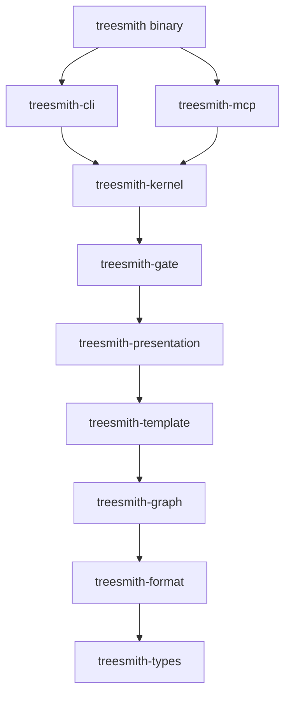

# Architecture

treesmith is a nine-crate Rust workspace compiled into one static binary. This page answers where
things live, why the crates layer the way they do, what happens on a write, and which invariants
the whole design hangs on. The binding contracts (exact APIs, JSON shapes, codec rules) live in
[`DESIGN.md`](../DESIGN.md); this page is the orientation layer above them.

## Where things live

```text
src/                             the `treesmith` binary: bridges CLI ↔ MCP surfaces
crates/                          one crate per layer (dependency direction: top → bottom)
  treesmith-types/               Guid, SectionKind, well-known platform GUIDs
  treesmith-format/              Rainbow/SCS codec: parse, emit, census, value formatters
  treesmith-graph/               item graph, indexes, repo file list, query engine
  treesmith-template/            template index, effective-template (inheritance) resolution
  treesmith-presentation/        layout XML, final-renderings delta merge, datasource + code map
  treesmith-gate/                deterministic gates G1–G7
  treesmith-kernel/              Workspace: the query/mutation API both surfaces call
  treesmith-cli/                 clap argument surface over the kernel
  treesmith-mcp/                 JSON-RPC-over-stdio surface over the kernel
tests/                           binary-level integration tests (CLI exit codes, MCP handshake)
fixtures/                        SYNTHETIC corpus — encodes DESIGN.md §15 assumptions, not real data
  corpus/                        16 codec edge-case files (BOM, CRLF, block literals, …)
  rainbow/basic/                 healthy mini repo: 20 items + views/controllers
  rainbow/broken/                one deliberate violation per gate G1–G7
DESIGN.md                        binding engineering contracts for the v0 build
treesmith-architecture-spec.md   the original product spec
```

## Crate layering

The dependency direction is a hard rule (spec §2 rule 4): each crate sees only the layers below
it, there are no cycles, and the two surfaces never import each other — the root binary bridges
them. This diagram is that rule; an edge means "depends on".



Two seams in that stack are deliberate quarantines:

- **`treesmith-format` is the only crate that knows the serialization dialect** (invariant I6).
  Nothing outside it names Rainbow, SCS, Unicorn, or YAML. Well-known *platform* GUIDs (template
  templates, layout fields, rendering templates) are domain vocabulary, not dialect, so they live
  in `types::wellknown` with neutral names.
- **`treesmith-mcp` is the only crate that knows MCP.** The protocol layer is a hand-rolled
  newline-delimited JSON-RPC loop (decision (c) in the
  [README](../README.md#decisions--deviations)); adopting a framework later touches one crate.

`treesmith-kernel` is a documented amendment to the spec's eight-crate tree (decision (d)): it
realizes the spec's "query / mutation API" node so both surfaces stay thin — the CLI parses
arguments and prints; the MCP server frames JSON-RPC; every behavior in between is a kernel
function returning the exact `serde_json::Value` both surfaces emit. That is what keeps the two
surfaces 1:1 (invariant I4): they cannot drift because neither contains logic.

## The write path

Every mutation (`set-field`, `forge`, `move`) goes through the same pipeline; no step is
skippable. The diagram reads left to right: what flows is the mutation request, then candidate
bytes, and only at the last node does anything touch disk.


1. **Template resolution.** Field IDs are never guessed from names: a field name resolves through
   the item's effective template (base-template chain applied); a field GUID must exist in that
   template unless it is a well-known system field.
2. **Slot from the definition.** Whether a value lands in shared, unversioned, or versioned
   storage comes from the field *definition's* section — never from where a value currently sits
   and never from caller flags (flags that contradict the section are rejected).
3. **Value validation.** Type-specific checks (`Checkbox`, `Integer`, `Date`, reference families),
   multilist normalization to storage form, layout values must parse as layout XML. Rejections are
   machine-readable `validation` errors (invariant I3).
4. **Self-check before disk.** The candidate bytes are re-parsed and re-emitted; the result must
   equal the candidate byte-for-byte, and the mutated slot must read back exactly the requested
   value. Any failure aborts with `self-check-failed` and **nothing is written** — treesmith never
   emits a file it cannot re-parse to an identical graph.
5. **Write, then refresh.** Files hit disk, then the graph re-parses exactly the changed paths so
   memory mirrors the working tree (invariant I1).

The corollary users see: because the codec preserves every lexical detail it parsed (see
[docs/formats.md](formats.md)), the only lines that change in a file are the lines the mutation
logically touched — `git diff` *is* the review surface.

## Determinism

Parse, resolve, and gate paths use no wall clock, no network, and no randomness (invariant I5).
The two documented exceptions: `census` reports elapsed wall time (it is a benchmark, not a
gate), and `forge` generates a random v4 GUID unless `--id` pins one. Everything else is
reproducible bit-for-bit: graph assembly sorts files by path, query results sort by `(path, id)`,
findings sort by `(gate, itemPath, code, message)`, and duplicate GUIDs deterministically keep the
lexically-first file while recording a fault.

Fault policy: `Workspace::open` succeeds on a broken tree with faults recorded, but every
operation except `census` then refuses with a `tree-fault` error (exit 3). Unparseable files are
never silently skipped — an agent can trust that "query returned 12 items" means the whole tree
was considered.

## The invariants

Every design decision above traces to one of the spec's eight invariants:

| # | Invariant | Where it is enforced |
|---|---|---|
| I1 | The git working tree is the only source of truth | Graph rebuilt/refreshed from disk after every write; no cache survives the process |
| I2 | Byte-identical round-trip: `emit(parse(bytes)) == bytes` | Lexical-preservation codec ([docs/formats.md](formats.md)); `census` is the falsifier |
| I3 | Schema-aware writes | Write-path steps 1–4; machine-readable rejection codes |
| I4 | Agent surface first, 1:1 across CLI and MCP | Both surfaces print the kernel's exact JSON |
| I5 | Deterministic gates | No clock/network/randomness; sorted outputs; [docs/gates.md](gates.md) |
| I6 | Serialization formats behind a trait | `SerializationFormat` in `treesmith-format`; dialect named nowhere else |
| I7 | One static binary | Root package; `cargo install --path .`; LTO + strip in release |
| I8 | Standalone IP | No platform SDK, no CMS dependency; the tool reads and writes files |

## Testing strategy

- **Unit tests per crate** for every codec rule, mutation behavior, and resolution rule; graph
  tests build tempdir mini-trees rather than depending on fixtures.
- **A corpus walker** round-trips every sniffable `.yml` under `fixtures/` — one test standing for
  invariant I2 across all 16 edge-case files and both fixture repos.
- **Binary-level integration tests** (`tests/`) drive the compiled binary: CLI exit-code classes
  0/1/2/3 and JSON shapes, and a full MCP handshake over pipes.
- **Determinism asserts**: gates and census run twice and compare JSON (with `elapsedMs`
  stripped).
- Mutation tests copy fixture repos to a temp dir — `fixtures/` is never mutated in place.

Current state at v0: 269 tests green across the workspace. What the tests *cannot* cover is recorded in
[`DESIGN.md` §15](../DESIGN.md) — the emitter-style assumptions that only a
[`census`](cli.md#census) against a real client repo can confirm or falsify.
