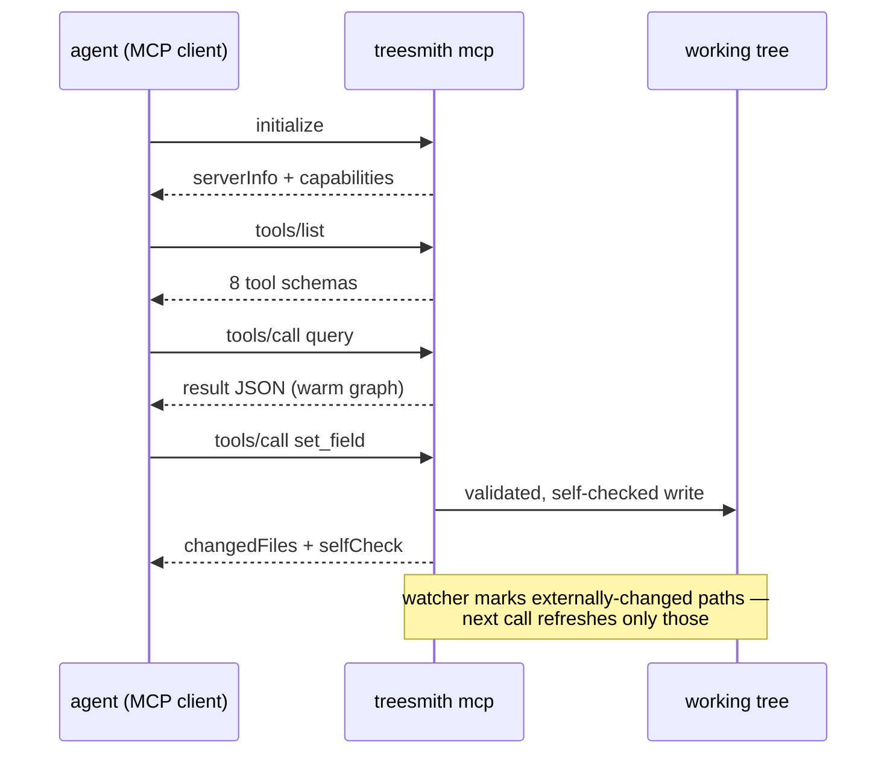

# MCP server guide

`treesmith mcp` turns the kernel into a long-running [Model Context
Protocol](https://modelcontextprotocol.io) server for coding agents: a JSON-RPC 2.0 server over
stdio that owns a **warm in-memory graph** and a **filesystem watcher**, so an agent session gets
sub-command-latency reads instead of re-parsing the tree on every call. Every CLI verb is exposed
1:1 as an MCP tool with the same JSON result the CLI would print.

The sequence below is the lifecycle of one agent session — everything after `initialize` hits the
warm graph.



## Registering the server

Point your MCP client at the binary with the repo root as an argument. For Claude Code and most
clients the config shape is:

```json
{
  "mcpServers": {
    "treesmith": {
      "command": "treesmith",
      "args": ["mcp", "--root", "/path/to/repo"]
    }
  }
}
```

There is nothing else to configure: no ports, no auth, no environment variables. The server is a
child process speaking newline-delimited JSON-RPC on stdin/stdout; diagnostics go to stderr. It
exits cleanly on stdin EOF.

## The tools

`tools/list` returns eight tools mirroring the CLI verbs 1:1 — snake_case where the verb has a
hyphen. Unlike the CLI's positional arguments, tool arguments are a **named camelCase object**.

| Tool | Required arguments | Optional arguments |
|---|---|---|
| `query` | `expr` | — |
| `get` | `item` | — |
| `set_field` | `item`, `field`, `value` | `language`, `version`, `createVersion` |
| `forge` | `template`, `parent`, `name` | `id`, `language` |
| `move` | `item`, `newParent` | `name` |
| `resolve_presentation` | `item` | `language`, `version` |
| `validate` | — | `gates` (array of `"G1"`…`"G7"`) |
| `census` | — | — |

Argument semantics are identical to the CLI verbs — designators, slot resolution, defaults, and
validation are all documented in [docs/cli.md](cli.md). `createVersion` defaults to `true` (the
CLI's `--no-create-version` inverted).

## A captured session

This transcript is a real session against `fixtures/rainbow/basic`, four requests in, three
responses out (the `initialized` notification gets no response, per JSON-RPC). Client → server:

```json
{"jsonrpc":"2.0","id":1,"method":"initialize","params":{"protocolVersion":"2025-06-18","capabilities":{},"clientInfo":{"name":"docs","version":"0"}}}
{"jsonrpc":"2.0","method":"notifications/initialized"}
{"jsonrpc":"2.0","id":2,"method":"tools/list"}
{"jsonrpc":"2.0","id":3,"method":"tools/call","params":{"name":"query","arguments":{"expr":"template:ArticlePage"}}}
```

Server → client (the `tools/list` response elided — its content is the table above):

```json
{"id":1,"jsonrpc":"2.0","result":{"capabilities":{"tools":{"listChanged":false}},"protocolVersion":"2025-06-18","serverInfo":{"name":"treesmith","version":"0.1.0"}}}
{"id":2,"jsonrpc":"2.0","result":{"tools":[ …8 tools… ]}}
{"id":3,"jsonrpc":"2.0","result":{"content":[{"text":"{\"count\":1,\"items\":[{\"db\":\"master\",\"file\":\"serialization/content/Home.yml\",\"id\":\"c0ffee00-0001-4000-8000-000000000001\",\"languages\":[{\"language\":\"da\",\"versions\":[1]},{\"language\":\"en\",\"versions\":[1,2]}],\"name\":\"Home\",\"path\":\"/sitecore/content/Home\",\"template\":{\"id\":\"7c1e1c2a-0020-4000-8000-000000000020\",\"name\":\"ArticlePage\"}}],\"ok\":true}","type":"text"}],"isError":false}}
```

The `tools/call` result's `content[0].text` is **exactly the JSON string the CLI would print** for
the same operation — one output contract across both surfaces, so anything written against the CLI
shapes ([docs/cli.md](cli.md)) works unchanged against MCP.

## Result and error semantics

- `tools/call` responses always arrive as `content[0].text` (a JSON string) plus an `isError`
  boolean.
- `isError: true` for kernel errors and for `validate` when the report contains error-severity
  findings. Kernel errors put their machine-readable payload
  (`{"ok":false,"error":{class,code,message,details}}`) in the text — **never** a protocol-level
  JSON-RPC error, so an agent always has a structured payload to branch on.
- Protocol-level errors are reserved for the protocol: unknown method → `-32601`, malformed JSON →
  `-32700`. Notifications (requests without `id`) never get responses; `ping` returns `{}`.
- `initialize` echoes the client's `protocolVersion` if it is one of `2024-11-05`, `2025-03-26`,
  `2025-06-18`, and answers `2025-06-18` otherwise.

## The warm graph and the watcher

The server parses the tree once at startup and keeps the graph, template index, and gate
configuration in memory. A filesystem watcher collects externally-changed paths (your editor, a
`git checkout`, another process) into a dirty set; **each `tools/call` drains that set first** and
re-parses only the changed files, so results always reflect the working tree without a full
rebuild. If the watcher cannot start, the server logs one line to stderr and falls back to
rebuilding the workspace before every call — slower, never stale.

Writes made *through* the server refresh the graph as part of the write path itself (the same
self-check-then-refresh sequence as the CLI; see
[docs/architecture.md](architecture.md#the-write-path)).

> [!NOTE]
> One server owns one root. To work across several serialized repos, register one `treesmith`
> entry per repo with different `--root` arguments.

## Implementation note: why not an MCP framework?

The server is a hand-rolled newline-delimited JSON-RPC loop — four protocol methods, zero async
runtime, no framework-drift risk (recorded as decision (c) in the
[README](../README.md#decisions--deviations)). `treesmith-mcp` is the only MCP-aware crate in the
workspace, so swapping in `rmcp` later would touch nothing outside it.
