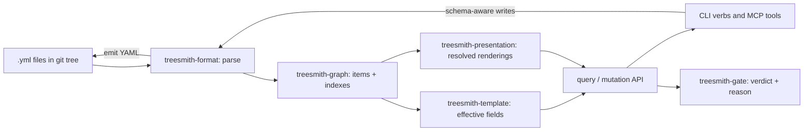

# treesmith — Architecture Specification v0.2

*Agent-first Rust content kernel for serialized CMS trees: parse → graph → resolve → mutate → validate, over a git working tree.*
*Spec date: 2026-07-15. Targets: Sitecore Unicorn (Rainbow YAML) and SCS YAML repos, MVC-first, local development only. Volatile claims carry an as-of basis in the Appendix.*

---

## 0. Thesis and positioning

treesmith is a **developer tool, not a CMS**. It gives coding agents template-aware, GUID-safe, structure-safe read/write access to a client's serialized content tree, and gives the human operator verification through tooling already trusted: `git diff`, CLI query output, and deterministic gates. It renders nothing, hosts nothing, and syncs nothing in v0.

The one positioning decision that shapes everything else: **kernel, not platform.** Every capability is a library function exposed through exactly two thin surfaces — CLI verbs and MCP tools. UIs, delivery endpoints (Layout Service / GraphQL), and Unicorn sync orchestration are deferred clients of the kernel, never owners of logic. The rejected alternative — building toward a standalone CMS with editing surfaces — was rejected because the wedge is local-dev agent workflows, the 9–15-month CMS path is dominated by GraphQL compatibility tail risk, and the kernel retains full value on any CMS project regardless of what Sitecore does. (Decided in founding session, 2026-07-15.)

Audience: coding agents first, a single human operator second. Priority order when they conflict: correctness of the write path > agent ergonomics > human ergonomics.

---

## 1. Design invariants

Numbered non-negotiables. Every later decision that depends on one cites it.

- **I1 — The git working tree is the only truth.** Every in-memory structure (graph, indexes, resolved views) is derived and rebuildable from the serialized files. No database, no sidecar state, no hidden cache that can disagree with disk. (Inverts rezidnt's log-is-truth I3: here Unicorn round-trips the files to Sitecore, so the files are canonical by construction.)
- **I2 — Round-trip fidelity.** `parse → serialize` with zero mutations is **byte-identical** for every item in the reference client repos. Enforced as CI gate zero against snapshot corpora in `fixtures/`. Fallback posture if byte-identical proves unreachable is a pre-committed pivot (trigger T1), not a quiet relaxation.
- **I3 — Every write is schema-aware.** Mutations pass through template resolution: correct field IDs, correct shared/unversioned/versioned section placement, GUID discipline. treesmith never emits a file it cannot re-parse to an identical graph. Raw string edits to item YAML are not a supported operation on any surface.
- **I4 — Agent surface first.** Every capability ships as an MCP tool and a CLI verb before (and possibly without) any UI. Human verification is `git diff` + CLI output; no capability may require a UI to be verifiable.
- **I5 — Gates are deterministic and interrogable.** Identical tree in → identical verdict out, with a machine-readable reason for every failure. No network, no wall clock, no randomness in any gate. (Transfer of rezidnt I6.)
- **I6 — Serialization formats live behind a trait.** Rainbow and SCS are the first two implementations of `SerializationFormat`; nothing outside the format crate names Sitecore, Unicorn, Rainbow, or SCS. Generalization to Optimizely/Umbraco is a seam kept open, not a v0 promise.
- **I7 — One static binary, no runtime dependencies, no telemetry.** `cargo install treesmith` or a curl install is the whole setup. (Transfer of rezidnt I7.)
- **I8 — IP standalone until the boundary lands.** No shared crates with rezidnt while the RBA IP boundary memo is unresolved: patterns copy, code does not. (Cited by the workspace layout in §2 and by O4/O5.)

Citation check: I1 → §2 graph crate, T2; I2 → §5 write path, P0 sequencing, T1; I3 → §5, §3 mutation contract; I4 → §3 surfaces, §7 deferred scope; I5 → §6; I6 → §2 format crate, O7; I7 → §2 binary layout; I8 → §2, O4, O5. No slogans.

---

## 2. Structure / taxonomy

The tree below answers: *where does each pipeline stage live, and what may depend on what?* It is **prescriptive** — the target layout for first commit, not a snapshot of an existing repo (none exists yet).

```text
treesmith/                        # Cargo workspace — target layout, prescriptive
├── crates/
│   ├── treesmith-types/          # IDs, GUIDs, field/template vocab; depends on nothing internal
│   ├── treesmith-format/         # SerializationFormat trait; rainbow/ + scs/ parse+emit (I2, I6)
│   ├── treesmith-graph/          # Item graph + indexes; derived, rebuildable (I1); watcher lives here
│   ├── treesmith-template/       # Base-chain resolution, effective field sets, type metadata
│   ├── treesmith-presentation/   # Layout XML, final-renderings delta merge, datasource + code map
│   ├── treesmith-gate/           # Deterministic validators (I5)
│   ├── treesmith-mcp/            # rmcp server; persistent process owning the warm graph
│   └── treesmith-cli/            # Verb surface; thin over the same library calls as MCP
├── src/main.rs                   # Single binary `treesmith` (I7); `treesmith mcp` launches server
└── fixtures/                     # Round-trip snapshot corpora from client repos (I2 gate inputs)
```

Rules that generate the structure (so additions don't re-derive intent):

1. **One crate per pipeline stage.** parse (format) → graph → template → presentation → gate. A new resolution stage is a new crate, not a module bolted into an existing one.
2. **Formats are quarantined.** Only `treesmith-format` may name a CMS or serialization dialect (I6). A new backend (SCS variant, Optimizely) is a new module inside it implementing the same trait.
3. **Surfaces are thin.** `treesmith-cli` and `treesmith-mcp` contain argument parsing, transport, and output shaping only; any logic they need lives in a library crate both can call (I4).
4. **Dependency direction is strictly down the list.** `types` ← everything; `format` ← `graph` ← `template`/`presentation` ← `gate` ← surfaces. No cycles, no surface-to-surface imports.
5. **Mirrors the rezidnt crate-per-concern layout by copied pattern, not shared code** (I8).

Naming: workspace crates `treesmith-*`, binary `treesmith`. There is **no `treesmithd`** — the pure-CLI-plus-MCP-process topology (O1) means no daemon binary exists unless trigger T2 fires.

---

## 3. Interface contracts

### 3.1 Resolution pipeline

The diagram answers: *how does a serialized YAML file become an answerable agent query, and where do writes re-enter the system?*



Writes re-enter through `treesmith-format`'s emitter — never through direct file manipulation — which is what makes I2 and I3 enforceable at one choke point.

### 3.2 CLI verbs

| Verb | Purpose |
|---|---|
| `treesmith query <expr>` | Path/template/field predicates over the graph |
| `treesmith get <id\|path>` | Item with resolved effective fields |
| `treesmith set-field` | Single-field mutation, template-validated |
| `treesmith forge` | Create item from template (GUID-safe, section-correct) |
| `treesmith move` | Structure-safe relocation, path/reference updates |
| `treesmith resolve-presentation <id\|route>` | Placeholder/rendering tree with datasources and code files |
| `treesmith validate [--gate <name>]` | Run gate engine; pre-commit-hook compatible |
| `treesmith mcp` | Launch the persistent MCP server |

**Output contract:** JSON on stdout when stdout is not a TTY; human-readable when it is; `--json` forces JSON. Diagnostics to stderr only.
**Exit codes:** `0` success · `1` gate/validation failure · `2` usage error · `3` tree unreadable (parse or fidelity fault). Gate failures and broken trees are different failure classes and scripts must be able to tell them apart.

### 3.3 MCP tools

Mirror the CLI verbs 1:1 — same names, same JSON shapes — implemented over the identical library calls (I4). The MCP process is long-running, owns the warm in-memory graph, and runs the filesystem watcher (`notify`) so agent sessions see sub-command-latency reads without a daemon. Transport: stdio via `rmcp` (O6).

### 3.4 Compatibility posture

Tolerant on read, strict on write — deliberately asymmetric:

- **Read:** parse whatever real Unicorn/SCS versions emit. Unknown keys and unrecognized constructs are preserved verbatim through the round-trip (I2 forces preservation rather than rejection). A file that cannot be parsed at all is surfaced as an exit-3 fault naming the file, never silently skipped.
- **Write:** mutation requests are validated against the resolved template before any emit. Unknown fields, wrong-section placement, or type-invalid values are rejected with the machine-readable reason (I3, I5).

---

## 4. Semantic core: template inheritance resolution

The stage everything else queries: base-template chains → effective field sets per item, with field IDs, types, and section membership (shared / unversioned / versioned). Budget honestly — this is where most kernel effort lands, and its correctness ceiling is the write path's correctness ceiling (I3 depends on it). Language/version resolution mimics Sitecore's fallback rules only to the extent the gates need (language-gap gate, G7); full fallback emulation is out of scope for v0.

---

## 5. Write path

The hard 20%, and the part that earns the tool its trust:

1. Field IDs resolved from the template chain, never guessed from names.
2. Section placement (shared/unversioned/versioned) derived from field definitions, never from where a field happened to sit.
3. Emitter produces Sitecore-compatible Rainbow/SCS formatting so Unicorn round-trips cleanly — the emitter is format-owned (per I6) and is the single choke point of §3.1.
4. Every mutation is immediately re-parsed and graph-compared as a self-check before the write is reported successful (I3's "never emits a file it cannot re-parse" made operational).

Consequence for O3: because I2 demands byte-level control of output, a generic YAML `Value`-DOM serializer is disqualified for the write path regardless of which parser reads.

---

## 6. Gate engine

v0 ships seven deterministic gates, all evaluable from the parsed graph plus a repo scan, all exposed via `treesmith validate` and the MCP tool (I5):

| # | Gate |
|---|---|
| G1 | Broken or missing datasource reference |
| G2 | Malformed layout XML or unresolvable final-renderings delta |
| G3 | Rendering item → missing code file |
| G4 | Placeholder mismatch (static `.cshtml` scan vs presentation references) |
| G5 | Field reference to nonexistent item |
| G6 | Template conformance on created/mutated items |
| G7 | Language-version gaps against a required-languages policy |

Gate additions must satisfy I5's determinism test before merging; anything requiring a network call or a running Sitecore instance is categorically not a gate.

---

## 7. Sequencing and launch scope

| Phase | Content | Completion threshold | Est. |
|---|---|---|---|
| P0 | Fidelity harness: parse every accessible client repo, round-trip census, parse-time benchmark on largest tree, repo survey (O7 evidence); USPTO trademark search; claim `github.com/treesmith` and set up registries under the treesmith org | Failure census + benchmark numbers in hand; O1 resolvable | Week 1 |
| P1 | Read kernel: format parse, graph, template resolution, read-only `query`/`get` on CLI + MCP | Effective-field answers correct against spot-checked Sitecore behavior on a real repo | +1–2 wk |
| P2 | Presentation resolution incl. final-renderings delta merge, code-file mapping | `resolve-presentation` correct on real MVC routes; unresolvable deltas reported, not crashed | +1–2 wk |
| P3 | Write path: `set-field`, `forge`, `move` with re-parse self-check | Mutated files accepted by Unicorn sync on a real project | +1 wk |
| P4 | Gate engine G1–G7 | `validate` runs as pre-commit hook on a client repo | +1 wk |

Total: **4–6 weeks to a daily-driver kernel** (founding-session estimate, unchanged). Confidence moderate; variance drivers are the final-renderings delta merge (P2) and write-path fidelity (P3).

**Deferred, seams left open:** management web UI (axum + rust-embed, preserving I7's one-binary stance), structural preview UI + live event feed, Layout Service/GraphQL delivery endpoints, Unicorn remote-sync orchestration, non-Sitecore format backends.
**Re-evaluation triggers for the deferred list:** a headless/JSS engagement pulls Layout Service/GraphQL forward; a second regular operator (human or team) pulls the management UI forward; an Optimizely/Umbraco engagement exercises the I6 seam.

### Kill / pivot triggers

- **T1 — Fidelity pivot.** If, after real emitter effort, byte-identical round-trip fails on formatting-trivia classes that require semantic interpretation to reproduce, pivot I2 to semantic-identical + canonical formatter, accepting a one-time reformat commit per repo. Observable: P0/P1 census shows irreducible failure classes.
- **T2 — Topology pivot.** If full-tree parse exceeds ~1 s on the largest client repo, the pure-CLI stance fails and a daemon (watcher + socket, rezidnt-style) is adopted; O1 flips. Observable: P0 benchmark.
- **T3 — Presentation scope cut.** If the final-renderings delta-merge edge-case tail exceeds its 2-week budget, ship without delta *resolution*: G2 reports unresolvable deltas and `resolve-presentation` marks them opaque. Observable: P2 burn.
- **T4 — Wedge collapse.** If Sitecore ships a credible free local-dev story, drop the compatibility framing; the kernel continues as an agent-native primitive only, and deferred delivery endpoints are cancelled rather than re-evaluated. Observable: vendor announcement.

---

## 8. Decisions register

### Resolved

- **O2 → decided (2026-07-15, owner): byte-identical, full effort.** P1 budgets real emitter work. T1 remains the pre-committed pivot if the P0 census surfaces failure classes requiring semantic interpretation — commitment does not delete the falsifier.
- **O4 → decided (2026-07-15, owner; revised same day): a standalone treesmith org owns the project.** GitHub repo under `github.com/treesmith`; crates.io and npm holds under the owner's accounts with the org as the published home. Supersedes the same-day interim decision to house it under the rezidnt org — rejected because it pre-empted the RBA IP boundary memo and coupled the two projects organizationally. The standalone org is the cleanest posture against I8: no code sharing *and* no ownership entanglement, so the memo can land either way without touching treesmith. One new load-bearing dependency: the `github.com/treesmith` name returned 403 (rate-limit) during the founding-session probe and remains unverified — claim it immediately; if squatted, the fallback naming decision reopens as an O-item.
- **O5 → decided (2026-07-15, owner): rezidnt licensing pattern from day one.** MIT OR Apache-2.0 on library crates, Apache-2.0 on the binary, public repository from first push. Consequence: the USPTO trademark search moves from "before public launch" to a P0 checklist item.

### Open (carried to v0.3)

| # | Decision | Options | Recommendation | Resolving evidence | Owner |
|---|---|---|---|---|---|
| O1 | Process topology | Pure CLI + persistent MCP process · standalone daemon | Pure CLI; MCP process provides warm state for free | P0 parse benchmark vs ~1 s threshold (T2) | User |
| O3 | YAML engine | Custom Rainbow/SCS-subset parser+emitter · saphyr/yaml-rust2 events for read + custom emitter · serde-saphyr typed reads | Custom emitter is forced by I2 (§5); for reads, start with yaml-rust2/saphyr event stream, replace with a custom subset parser if event-level fidelity data (comments, quoting, ordering) proves insufficient. serde_yaml and serde_yml are both dead ends (Appendix) | Formatting-variance survey from P0 corpus | User |
| O6 | MCP SDK | rmcp (official) · hand-rolled JSON-RPC | rmcp ≥ 0.16 (1.x migration pending upstream); stdio transport, tool macros fit the surface | Short spike wiring one mutation tool end-to-end | User |
| O7 | Format matrix | Which Unicorn versions; SCS coexistence handling; delta + dynamic-placeholder prevalence | Support what the accessible repos actually contain, nothing speculative (I6 keeps additions cheap) | P0 repo survey | User |

Resolve or explicitly carry each remaining O-item before tagging v0.3 — none may silently disappear.

---

## Appendix — Ground truth, volatile facts, caveats

| Claim | Status | As-of / source |
|---|---|---|
| crates.io `treesmith` available | Verified (404 probe) | 2026-07-15, founding session |
| npm `treesmith` available | Verified (404 probe) | 2026-07-15, founding session |
| `treesmith.dev` / `.io` unregistered; `.com` taken (arborist) | Verified (DNS NS probe) | 2026-07-15, founding session |
| Homebrew: no formula collision | Verified | 2026-07-15, founding session |
| `github.com/treesmith` username status | **Unverified and now load-bearing** — it is the owning org per O4 (revised); API 403 during probe; claim manually before anything else | 2026-07-15 |
| Trademark | **Unchecked** — physical tree-service businesses use the name; different goods class, low risk; USPTO search is a P0 item since the repo is public from day one (O5) | 2026-07-15 |
| `serde_yaml` deprecated | Verified — archived at 0.9.34+deprecated | 2026-07-15, rust-lang forum / crates.io (deprecation dated 2024-03) |
| `serde_yml` unmaintained | Verified — its own docs direct migration to noyalib, serde-saphyr, or yaml-rust2 | 2026-07-15, serde_yml docs |
| `rmcp` official MCP Rust SDK, tokio, 0.16.0, 1.x migration guide published | Verified | 2026-07-15, modelcontextprotocol/rust-sdk README |
| 50k-item tree parses well under 1 s with rayon | **Assumption** — training-vintage heuristic; P0 benchmark is the scheduled falsifier | Unverified |
| Rainbow/SCS field-section semantics and final-renderings delta format details | Training-vintage; verified against real repos in P0 | Unverified until P0 |

**Volatility isolation summary** (which module owns each churning surface): Rainbow/SCS dialect quirks → `treesmith-format` only (I6). YAML engine choice (O3) → internal to `treesmith-format`; swappable without touching the graph. MCP protocol evolution (rmcp 1.x) → `treesmith-mcp` only. Sitecore fallback/language semantics → `treesmith-template`, exercised only by G7. Client-repo idiosyncrasies → `fixtures/` corpora, versioned with the code.

---

*Revision log:*
- *v0.1 — initial synthesis from founding session (2026-07-15); O1–O7 open.*
- *v0.2 — O2 (byte-identical, full effort), O4 (owning org), O5 (rezidnt licensing, public from day one) resolved by owner (2026-07-15). O1, O3, O6, O7 carried, evidence-gated on P0 and the rmcp spike.*
- *v0.2 amendment (2026-07-15) — O4 revised: standalone treesmith org, superseding the rezidnt-org decision made earlier the same day. `github.com/treesmith` claim promoted to a P0 blocker.*
